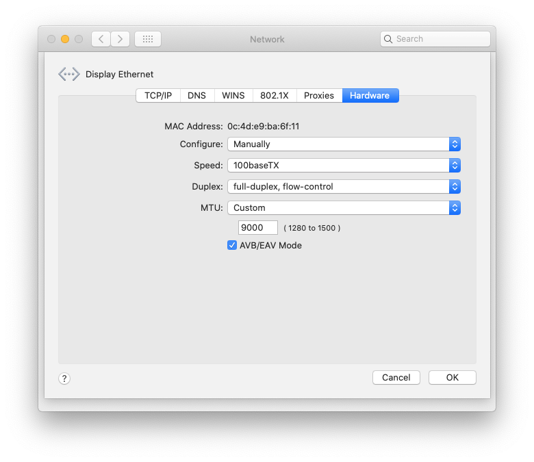

# Machine Vision Perception based on Spinnaker Cameras
The module contains Teledyne/FLIR/Point Grey camera drive and associated testing code  
Currently only GigE/PoE cameras are supported.

## Thanks
Thanks Maxar for donating hours and allowing me, as a Maxar Space Robotics Software Engineer, to open source this project.

## Dependencies
### Build Dependencies
#### Spinnaker SDK
- [flir/Spinnaker SDK] (https://www.flir.com/support-center/iis/machine-vision/downloads/spinnaker-sdk-flycapture-and-firmware-download/) - Spinnaker SDK

#### OpenCV
- [Ubuntu]  
`sudo apt install libopencv-dev python3-opencv`
- [macOS]  
`brew install opencv`

#### (Optional) gstreamer 1.0 (required by streaming app)
- [Ubuntu] (https://gstreamer.freedesktop.org/documentation/installing/on-linux.html?gi-language=c) - Installation
- [macOS]  
`brew install gstreamer gst-plugins-base gst-plugins-good gst-plugins-bad gst-plugins-ugly gst-libav`
- If you don't need streaming, make the following change at CMakeLists.txt to not use it:  
`set(STREAMING FALSE)`

#### (Optional) ament-cmake
The code is design to be able to run in ROS.
If you don't have ament-cmake, and you can either 
- Remove the ament-cmake reference from CMakeLists.txt, or
- Install ament-cmake package

### Running Dependencies
Same as the build dependencies, plus the following to play streaming video.
#### (Optional) FFmpeg
- [Ubuntu]  
`sudo apt install ffmpeg`
- [macOS]  
`brew install ffmpeg`

## Build
By default, the driver and test apps:  
`gigev_config` and  
`machine_vision_streaming`  
will be built. Please follow normal cmake project build process.

## GigE Camera Hardware Setup
- Networking  
It is important to set network adapter's MTU to take Jumbo packets.
    - In Ubuntu, when the network adapter is eth0:  
`sudo ifconfig eth0 mtu 9000 up`  
If there is warning, bring down the adapter first, then rerun the above:  
`sudo ifconfig eth0 down`

    - In macOS, not all Gige network adapter can be changed to take Jumbo packets.  
If you're lucky, here's one screen shot showing the adapter is configured properly.

    - Use `ifconfig` to verify if MTU is properly set  
- PoE Switch used to power the camera

## Run
### Running camera configuration and streaming apps
It may need to run the following apps multiple time in order to connect to the right camera.  
If there are multiple network adapters from the host, the same GigE camera will show up multiple times. FLIR's GigE camera broadcasts heartbeat packets, camera driver iterates through all active adapters.
- `gigev_config`  
The app is able to list connected GigE camera(s), and show camera(s)' configurable parameters, and performs image acquisition for 10s.  
    - Run the app without argument or with `--help` to show help
    - Use `-l` to list camera and its configurable parameters  
    Note host IP address is listed along camera, and this IP address tells which adapter it belongs to.
    - Use `-c` to specify which camera to connect  
    When there is no other options, it runs for about 10 second to acquire and save images. The number of saved images depends on the camera's frame rate.
    - Use `-m` to specify video mode
    - Use `-w` and/or `-h` to specify image size
    - Use `-f` to specify frame rate
- `machine_vision_streaming`  
The app aquires images from camera and sends 2 encoded H.264 streams over UDP to specified host (port 5000 and 5001) with gstreamer.  
The first stream contains the origin acquired images, the second stream contains converted gray scale images with various computer vision filters applied (inverse, Canny, and Sobel, etc).
You can use `gigev_config` to change camera settings for different mode, frame rate and image size.  
    - Run the app without argumenet or with `--help` to show help
    - Use `-s` to specify host IP address the streamming sends UDP packets to.
    - Use `-c` to specify which camera  

### Displaying streaming video
- gstreamer  
To show streaming video, use the following gstream pipeline examples on the host before running the app on the target:  
    - raw camera images  
    `gst-launch-1.0 udpsrc port=5000 caps="application/x-rtp,media=video,clock-rate=90000,encoding-name=H264,payload=96" ! rtph264depay ! decodebin ! videoconvert ! autovideosink sync=false`  
    - gray level images with some filters applied  
    `gst-launch-1.0 udpsrc port=5001 caps="application/x-rtp,media=video,clock-rate=90000,encoding-name=H264,payload=96" ! rtph264depay ! decodebin ! videoconvert ! autovideosink sync=false`

- ffmpeg  
By using SDP or <a href="https://en.wikipedia.org/wiki/Session_Description_Protocol">Session Description Protocol</a>, I can view streaming result. But there are some delays (couple of seconds range), so it may not fit for a realtime application.  
`ffplay -protocol_whitelist file,http,https,rtp,udp -i h264.sdp`    
One example SDP is provided [here](resources/h264.sdp.txt)  
To fit your needs, make the following changes for IP address where streaming from, and port  
`o=- 0 0 IN IP4 `**`127.0.0.1`**` `  
`m=video `**`5000`**` RTP/AVP 96`

- VLC  
I'm unable to display H.264 encoded video streaming in UDP/RTP from VLC. I believe doing the following could fix the problem by properly setting SDP's  
`profile-level-id`  
`sprop-parameter-sets`

- HTML5 browser  
I only tried Firefox with TCP and codec  
`video/ogg`  
But I'm not able to view with UDP and H.264 codec  
`video/mp4`  
which is what the streaming app uses. I will update here once I get HTML5 working

## Limitation
1. Currently, only Point Grey's GigE/PoE camera is supported.

2. Tested camera:
- Point Grey Grasshopper - GS3-PGE-60S6M-C
- Point Grey Blackfly - BFLY-PGE-50S5C

3. Tested OS:
- Ubuntu 20.04 AMD64
- Ubuntu 22.04 ARM64
- macOS 10.15.7 Catalina

## To do
Will add ROS2 (Foxy and Humble) perception support
